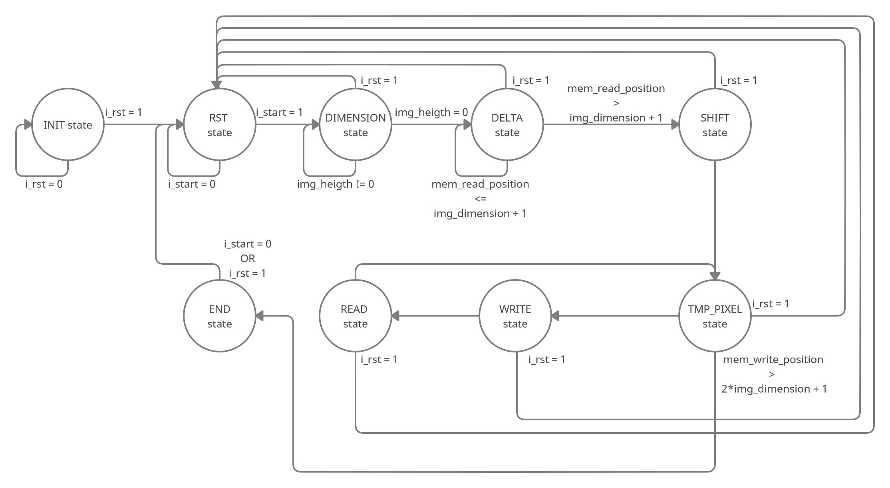

# Digital Logic Design Project: Histogram Equalization

## Introduzione

Questo progetto implementa, utilizzando il linguaggio di descrizione hardware VHDL, una versione semplificata di un algoritmo standard di equalizzazione dell’istogramma per immagini in scala di grigi. Il sistema è progettato per ricalibrare il contrasto di un’immagine quando i valori di intensità sono molto vicini tra loro, ridistribuendoli su tutto l’intervallo possibile.

**Autori**:  
- Gabriele D’Angeli  
- Francesco Di Stefano  

**Anno Accademico**: 2020/2021  

---

## Funzionalità

- **Supporto immagini**: solo immagini in scala di grigi a 256 livelli, con dimensione massima 128x128 pixel.
- **Operazioni principali**:
  - Calcolo del valore minimo e massimo dei pixel.
  - Trasformazione del pixel corrente basata su un algoritmo di shift e limitazione.
  - Scrittura dell’immagine equalizzata nella memoria.
- **Interfaccia hardware**: progettata per integrarsi con un sistema di memoria e testbench simulativi.

---

## Specifiche tecniche

### Algoritmo implementato

L'algoritmo segue questa logica per ogni pixel:
1. Calcolo del **Delta Value**:

Ecco il codice per il file README.md in formato Markdown, che puoi inserire direttamente nella tua repository GitHub:

markdown
Copy code
# Digital Logic Design Project: Histogram Equalization

## Introduzione

Questo progetto implementa, utilizzando il linguaggio di descrizione hardware VHDL, una versione semplificata di un algoritmo standard di equalizzazione dell’istogramma per immagini in scala di grigi. Il sistema è progettato per ricalibrare il contrasto di un’immagine quando i valori di intensità sono molto vicini tra loro, ridistribuendoli su tutto l’intervallo possibile.

**Autori**:  
- Gabriele D’Angeli  
- Francesco Di Stefano  

**Anno Accademico**: 2020/2021  

---

## Funzionalità

- **Supporto immagini**: solo immagini in scala di grigi a 256 livelli, con dimensione massima 128x128 pixel.
- **Operazioni principali**:
  - Calcolo del valore minimo e massimo dei pixel.
  - Trasformazione del pixel corrente basata su un algoritmo di shift e limitazione.
  - Scrittura dell’immagine equalizzata nella memoria.
- **Interfaccia hardware**: progettata per integrarsi con un sistema di memoria e testbench simulativi.

---

## Specifiche tecniche

### Algoritmo implementato

L'algoritmo segue questa logica per ogni pixel:
1. Calcolo del **Delta Value**:
     - DELTA VALUE = MAX PIXEL VALUE - MIN PIXEL VALUE
2. Calcolo dello **Shift Level**:
     - SHIFT LEVEL = 8 - FLOOR(LOG2(DELTA VALUE + 1))
3. Calcolo del valore temporaneo del pixel:
     - TEMP PIXEL = (CURRENT PIXEL VALUE - MIN PIXEL VALUE) << SHIFT LEVEL
4. Scrittura del nuovo valore:
     - NEW PIXEL VALUE = MIN(255, TEMP PIXEL)

     
---

## Architettura

La macchina a stati finiti è composta da 9 stati principali, tra cui `INIT`, `DELTA`, `TMP PIXEL`, e `END`.  
Ecco il diagramma degli stati:  

### Utilization Report
- **Flip-Flop (FF) utilizzati**: 143 (0.05%)
- **Look-Up Table (LUT) utilizzate**: 182 (0.14%)

---

## Risultati dei Test

### Test dei casi limite

1. **Immagine nulla** (0x0 pixel): nessuna scrittura in memoria.
2. **Pixel singolo con valore 0**: mantiene il valore 0.
3. **Pixel singolo con valore 255**: il pixel è equalizzato a 0.

### Test di funzionamento
- **Reset asincrono**: il componente si ripristina correttamente e riprende l'elaborazione.  
- **Elaborazioni multiple**: il sistema elabora correttamente più immagini in sequenza.

Esempio di immagine prima e dopo l’equalizzazione:

---

## Repository Structure

- `/code`: file VHDL del progetto.
- `/docs`: documentazione aggiuntiva e immagini.

---

## Requisiti

- **Ambiente di sviluppo**: Xilinx Vivado.
- **Requisiti hardware**: FPGA compatibile con l’utilizzo di 182 LUT e 143 FF.

---

